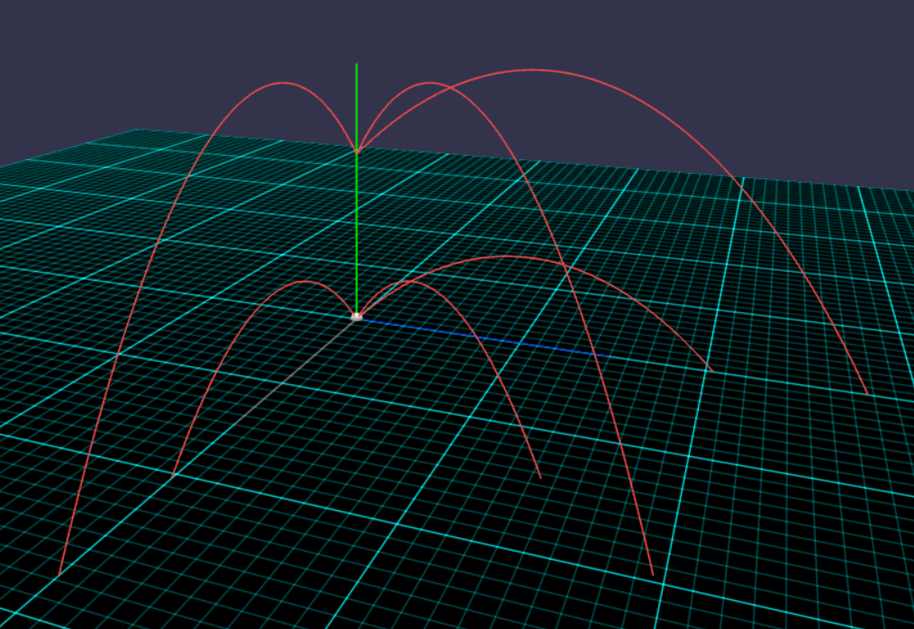

Тестування — Ітерація 2: 3D Сцена Babylon.js
Що тестуємо
Правильність відображення траєкторії у 3D-просторі — чи відповідає напрямок і форма лінії заданим кутам.
 
### Тест 1 — рух по осі X (φ = 0°)
 
| Поле | Значення |
|------|----------|
| v0 | 20 м/с |
| θ | 45° |
| φ | **0°** |
| y0 | 0 м |
 
**Очікуємо:** лінія лежить у площині XY, координата Z = 0 по всій траєкторії.  
Якщо подивитись зверху — лінія іде прямо вздовж червоної осі X.
 
| Перевірка | Результат |
|-----------|-----------|
| Траєкторія у площині XY | ✓ |
| Z = 0 (лінія не відхиляється по Z) | ✓ |
| Кінець лінії ≈ 40.8 м по осі X (по сітці) | ✓ |
 
---
 
### Тест 2 — рух по осі Z (φ = 90°)
 
| Поле | Значення |
|------|----------|
| v0 | 20 м/с |
| θ | 45° |
| φ | **90°** |
| y0 | 0 м |
 
**Очікуємо:** лінія лежить у площині ZY, координата X = 0.  
Якщо подивитись зверху — лінія іде вздовж синьої осі Z.
 
| Перевірка | Результат |
|-----------|-----------|
| Траєкторія у площині ZY | ✓ |
| X = 0 (лінія не відхиляється по X) | ✓ |
 
---
 
### Тест 3 — діагональний рух (φ = 45°)
 
| Поле | Значення |
|------|----------|
| v0 | 20 м/с |
| θ | 45° |
| φ | **45°** |
| y0 | 0 м |
 
**Очікуємо:** лінія іде рівно між осями X і Z (під 45° якщо дивитись зверху).
 
| Перевірка | Результат |
|-----------|-----------|
| Лінія між X і Z під рівним кутом | ✓ |
 
---
 
### Тест 4 — кидок із висоти (y0 = 20 м)
 
| Поле | Значення |
|------|----------|
| v0 | 20 м/с |
| θ | 45° |
| φ | 0° |
| y0 | **20 м** |
 
**Очікуємо:** початок лінії знаходиться на висоті 20 м по осі Y (не від землі).
 
| Перевірка | Результат |
|-----------|-----------|
| Лінія починається вище рівня сітки | ✓ |
 
---
 
### Тест 5 — накопичення ліній
 
1. Побудувати траєкторію з φ = 0°
2. Побудувати ще одну з φ = 90°
 
**Очікуємо:** обидві лінії видимі одночасно.
 
| Перевірка | Результат |
|-----------|-----------|
| Дві лінії на сцені після двох кліків | ✓ |
